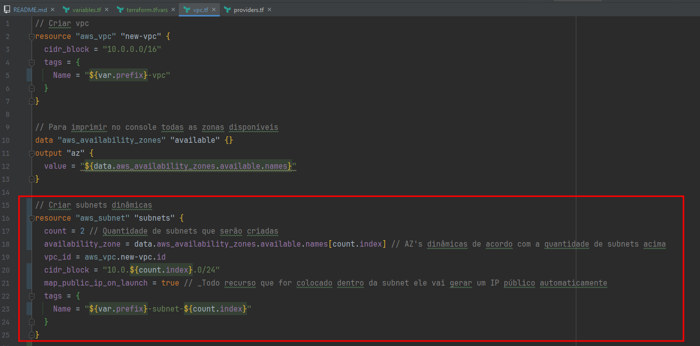

# Terraform avançado

## Conceitos de VPC na AWS

O conceito de **VPC** (Virtual Private Cloud) é uma **rede virtual na nuvem** que permite que você **crie recursos de computação,**
**armazenamento** e **rede** de _**forma isolada**_ e segura dentro do ambiente da AWS.

Através do VPC, é possível **definir sub-redes**, **tabelas de roteamento**, **gateways de internet** e regras de segurança para
controlar o tráfego de entrada e saída dos recursos hospedados na nuvem.

>**Para entender mais sobre VPC e console AWS**, veja o módulo `Criando cluster Kubernetes` no curso
de **Terraform** do Full Cycle.

---

### Configurarção inicial da AWS

Crie um usuário **admin** e uma **chave de acesso**.

Baixe o **AWS CLI** e digite no terminal: `aws configure` e informe a chave de acesso. (Utilize a região: `us-east-1`)

---

### Criando VPC

Vamos criar uma **VPC com o Terraform**, mas antes, precisamos adicionar o provider da AWS no Terraform, para isso
utilizaremos o arquivo `providers.tf`.

Para rodá-lo, utilize o comando: `terraform init`.

No arquivo `vpc.tf` vamos criar a configuração da VPC.

> Para saber mais sobre a documentação do provider da AWS, abra: https://registry.terraform.io/providers/hashicorp/aws

Com o arquivo `vpc.tf` criado, vamos executar os comandos: `terraform plan` e logo após: `terraform apply --auto-approve`.

Você verá que foi criada a **VPC** no seu **Console AWS:**

---

### Criando Subnets estáticas

Para criar **subnets**, utilize o `vpc.tf` e nele vamos criar um resource de _**aws_subnet**_.

Após criado o **resource**, basta executar o comando: `terraform apply --auto-approve` e checar no **Console AWS** as subnets.

> Para deixar as subnets com as tags mais flexíveis, podemos utilizar o `variables.tf` e o `terraform.tfvars` para **criar a
variável** `prefix`:

### Criando Subnets dinâmicas

***Obs:** Caso você tenha criado a subnet estática acima, **comente todos os resources referente a subnet** no `vpc.tf`,
execute o comando: `terraform apply --auto-approve` e **descomente a parte da subnet dinâmica**.

> **Lembre-se**, você não conseguirá rodar as subnets dinâmicas e estáticas juntas.

No arquivo `vpc.tf` vamos **criar um resource dinâmico** como a imagem e **comentar os que foram criados** acima:

Execute o comando: `terraform apply --auto-approve` e confirme no **Console AWS**.

---

### Criando Internet Gateway e Route Table

No arquivo `vpc.tf` vamos **criar 3 resources**, o primeiro será para criar o **Internet Gateway**, o segundo para criar a
**Route Table** e o terceiro para **associar as subnets na Route Table**.

---

### Criando Security Group

O **Security Group** servirá para proteger o _**acesso direto**_ na nossa aplicação na internet, mas permitirá que nossa aplicação
tenha acesso total na internet.

Para isso, **vamos configurar o** `cluster.tf`:

Execute o comando: `terraform apply --auto-approve` e cheque na aba `Security Groups` no **Console da AWS**:

---

### Criando Role e Policies

Vamos **liberar permissões para o nosso Cluster**, como por exemplo **_Auto Scaling_**, criar **_EC2_**, **_ELB_**, entre outros.

Para isso, no `cluster.tf`, vamos criar a **Role** e em seguida as **2 policies necessárias**:

Execute o comando: `terraform apply --auto-approve` e cheque na aba `IAM/Funções` no **Console da AWS**:

---