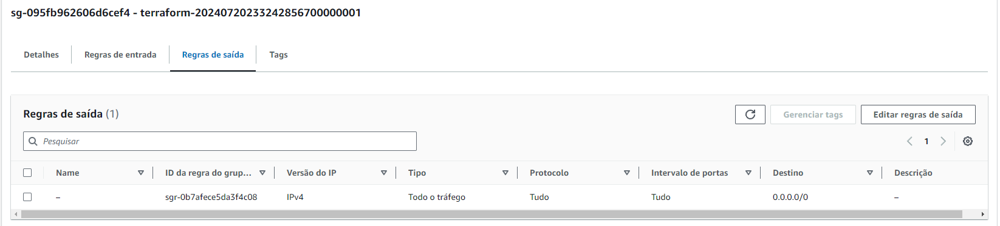

# Terraform avançado

## Conceitos de VPC na AWS

O conceito de **VPC** (Virtual Private Cloud) é uma **rede virtual na nuvem** que permite que você **crie recursos de computação,**
**armazenamento** e **rede** de _**forma isolada**_ e segura dentro do ambiente da AWS.

Através do VPC, é possível **definir sub-redes**, **tabelas de roteamento**, **gateways de internet** e regras de segurança para
controlar o tráfego de entrada e saída dos recursos hospedados na nuvem.

>**Para entender mais sobre VPC e console AWS**, veja o módulo `Criando cluster Kubernetes` no curso
de **Terraform** do Full Cycle.

---

### Configuração inicial da AWS

Crie um usuário **admin** e uma **chave de acesso**.

Baixe o **AWS CLI** e digite no terminal: `aws configure` e informe a chave de acesso. (Utilize a região: `us-east-1`)

### *Importante:

Saiba que ao criar um `EKS ou EC2` na AWS vai te **gerar custos**, caso queira criar, **lembre-se sempre de excluí-los**
e **para excluir todas as configurações** que foram criadas, utilize o comando: `terraform destroy` e verifique no
**console da AWS**.

---

### Criando VPC

Vamos criar uma **VPC com o Terraform**, mas antes, precisamos adicionar o provider da AWS no Terraform, para isso
utilizaremos o arquivo `providers.tf`.

Para rodá-lo, utilize o comando: `terraform init`.

No arquivo `vpc.tf` vamos criar a configuração da VPC.

> Para saber mais sobre a documentação do provider da AWS, abra: https://registry.terraform.io/providers/hashicorp/aws

Com o arquivo `vpc.tf` criado, vamos executar os comandos: `terraform plan` e logo após: `terraform apply --auto-approve`.

Você verá que foi criada a **VPC** no seu **Console AWS:**

---

### Criando Subnets estáticas

Para criar **subnets**, utilize o `vpc.tf` e nele vamos criar um resource de _**aws_subnet**_.

Após criado o **resource**, basta executar o comando: `terraform apply --auto-approve` e confirme na aba `VPC/Subnets` no **Console AWS**.

> Para deixar as subnets com as tags mais flexíveis, podemos utilizar o `variables.tf` e o `terraform.tfvars` para **criar a
variável** `prefix`:

### Criando Subnets dinâmicas

***Obs:** Caso você tenha criado a subnet estática acima, **comente todos os resources referente a subnet** no `vpc.tf`,
execute o comando: `terraform apply --auto-approve` e **descomente a parte da subnet dinâmica**.

> **Lembre-se**, você não conseguirá rodar as subnets dinâmicas e estáticas juntas.

No arquivo `vpc.tf` vamos **criar um resource dinâmico** como a imagem e **comentar os que foram criados** acima:

Execute o comando: `terraform apply --auto-approve` e confirme na aba `VPC/Subnets` no **Console AWS**.

---

### Criando Internet Gateway e Route Table

No arquivo `vpc.tf` vamos **criar 3 resources**, o primeiro será para criar o **Internet Gateway**, o segundo para criar a
**Route Table** e o terceiro para **associar as subnets na Route Table**.

Execute o comando: `terraform apply --auto-approve` e confirme na aba `VPC/Internet Gateway` e `VPC/Route Table`
no **Console da AWS**.

---

### Criando Security Group

O **Security Group** servirá para proteger o _**acesso direto**_ na nossa aplicação na internet, mas permitirá que nossa aplicação
tenha acesso total na internet.

Para isso, **vamos configurar o** `cluster.tf`:

Execute o comando: `terraform apply --auto-approve` e cheque na aba `VPC/Security Groups` no **Console da AWS**:

---

### Criando Role e Policies

Vamos **liberar permissões para o nosso Cluster**, como por exemplo **_Auto Scaling_**, criar **_EC2_**, **_ELB_**, entre outros.

Para isso, no `cluster.tf`, vamos criar a **Role** e em seguida as **2 policies necessárias**:

Execute o comando: `terraform apply --auto-approve` e cheque na aba `IAM/Roles` no **Console da AWS**:

---

### Subindo Cluster EKS

**Com todas as configurações feitas**, podemos subir o `Cluster EKS`, para isso, vamos criar _**2 resources**_.

O primeiro para **salvar os logs** do nosso Cluster e o segundo para **criar o Cluster na AWS**.

Execute o comando: `terraform apply --auto-approve` e aguarde a inicialização do Cluster.

Você pode visualizar a criação do Cluster na aba `EKS/Clusters` no **Console da AWS**:

---

### Criando Workers para o Cluster

Vamos criar os `nós/nodes/workers` do **Cluster** e para isso utilizaremos o arquivo `node.tf`.

Antes de tudo, **criaremos uma role** para que os `nós/nodes/workers` tenham permissão no **EC2**.

Agora vamos adicionar as **policies** na **Role** dos `nodes`:

Execute o comando: `terraform apply --auto-approve` e confirme na aba `IAM/Roles` no **Console AWS**:

Com isso feito, vamos **criar o resource** do `node`:

Execute o comando novamente: `terraform apply --auto-approve` e confirme na aba `Clusters` no **Console AWS**:

**Importante:**

Ao criar um **resource** de `Node Group`, sempre adicione o `instance_types` e coloque o tipo de instância que estiver
como **FREE TIER** no momento, você pode checar em: https://aws.amazon.com/pt/free

---

### Criando kubeconfig

Para criar o arquivo **kubeconfig** e conseguir acessar o cluster pelo comando: `kubectl`, vamos utilizar o arquivo `outputs.tf`,
nele passaremos a **configuração do kubernetes** da AWS, e utilizaremos o **resource** `local_file` para ele
gerar esse arquivo do **kubeconfig** na nossa máquina.

Execute o comando: `terraform apply --auto-approve` e você verá que um novo arquivo com nome `kubeconfig` foi criado.

Agora, você precisará **baixar o aws-iam-authenticator**:

> Caso esteja no Windows execute o comando: `choco install -y aws-iam-authenticator`

Após isso, **substitua o arquivo** da pasta `.kube/config` com o comando: `cp kubeconfig ~/.kube/config`.

Ao rodar o comando: `kubectl get nodes` você terá os nós/nodes/workers que subimos na AWS.

---

### Criando deploy

Com o Cluster e os nodes configurados, vamos criar um deploy simples de uma imagem do nginx, para isso:

Execute o comando: `kubectl create deploy nginx --image=nginx`.

Confirme se o pod foi criado com: `kubectl get pods`.

Para testar, direcione a porta do nginx com: `kubectl port-forward pod/{nome_pod} 8181:80`.

Abra em seu navegador: `localhost:8181` e deverá aparecer:

---

### Excluir todas as configurações do Terraform

**Para excluir todas as configurações** de `VPC, IAM, EC2, EKS`, utilize o comando: `terraform destroy`.

---

# Iniciando com Módulos

Os **módulos** agrupam vários resources em um lugar só, ele é muito útil quando trabalhamos com muitos resources.

## Pasta `modules/vpc`

Nela serão configurados as VPC, Subnets, Internet Gateway, Route Table, entre outros.

Teremos o arquivo `main.tf` que será o responsável por todos os resources, no arquivo `outputs.tf` mostrará todos os
resultados que vamos precisar e no arquivo `variables.tf` colocaremos as variáveis.

Vamos passar todas as informações do arquivo `vpc.tf` para o `modules/vpc/main.tf` e delete o arquivo: `vpc.tf`.

Passe também a **_var.prefix_** do `variables.tf` para o `modules/vpc/variables.tf`.

## Pasta `modules/eks`

Nela serão configurados o Cluster e os Nodes.

Seguindo a ordem, teremos todos os **resources** do arquivo `cluster.tf` na `modules/eks/main.tf` e com isso podemos deletá-lo.

Vamos criar as variáveis necessárias como: `vpc_id`, `prefix`, `retention_days`, `subnets_ids`, entre outros.

Vamos passar também **toda a configuração** do arquivo `node.tf` para o `modules/eks/main.tf` e suas variáveis e com isso podemos deletá-lo.

Para finalizar, vamos colocar todo o código de `outputs.tf` (configuração do kubeconfig) em `modules/eks/outputs.tf`.

---

## Criando o módulo

Na raiz do projeto, teremos o arquivo `main.tf` , que será o **responsável por iniciar os módulos** de `VPC e EKS`.

> Nele passaremos o **path** que está os arquivos do `VPC e EKS` e os **valores de todas as variáveis**.

**Obs:** Para exportar uma variável de um módulo para outro, é necessário criar um output no arquivo `outputs.tf`.

### Subindo módulo

Execute o comando: `terraform init` para que o Terraform reconheça os módulos.

Execute o comando: `terraform plan` e em seguida: `terraform apply --auto-approve` para **criar e subir** todas as configurações na AWS.

---

## Sobre o tfstate

O `terraform.tfstate` é um arquivo importantíssimo quando falamos de Terraform, pois ele contém todas as informações de versões, ids, entre outros.

E para que não haja **conflitos de versionamento** ou **perda** desse arquivo quando estamos trabalhando em equipe, vamos centralizá-lo
no `S3` da AWS.

Para isso, vamos adicionar o código abaixo no arquivo `main.tf`:

No console da AWS, vamos criar um **S3** com o nome `myfcbucket`, lembre-se de deixar a opção `Block all public access` tickada,
e ative a opção `Bucket Versioning`.

Depois de criado, vamos rodar o comando: `terraform init` e **yes**:

O arquivo será criado no S3 e com isso podemos apagar o `terraform.tfstate` e `terraform.tfstate.backup` que está no projeto local.